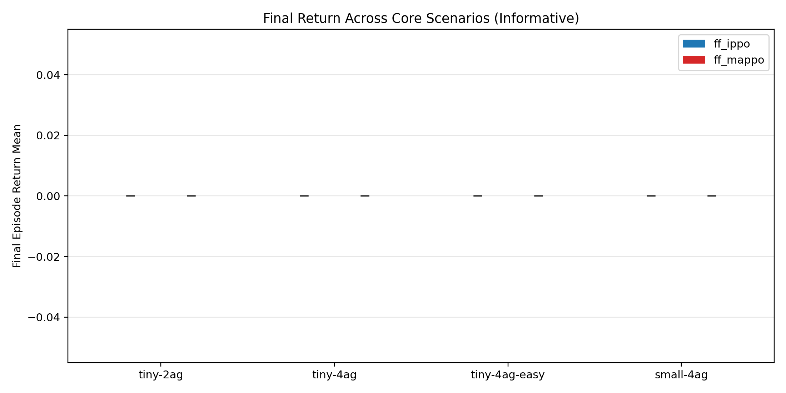
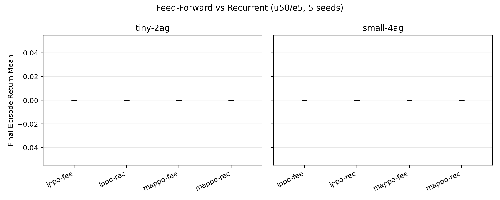
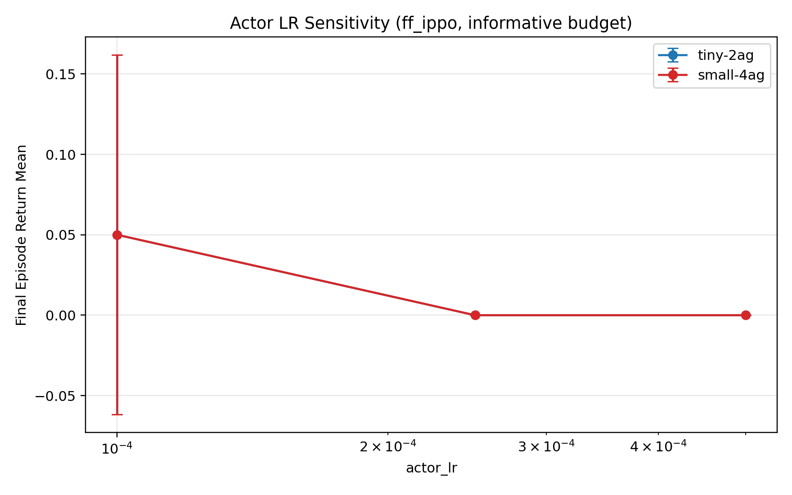
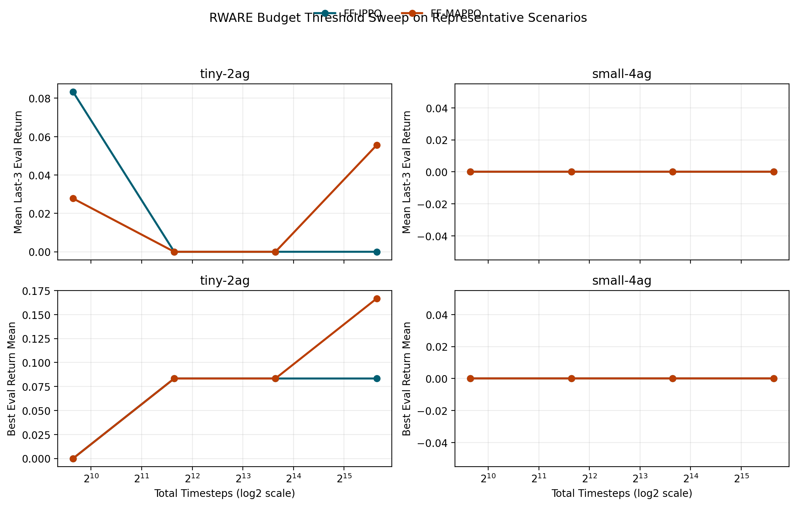

# MARL Experiment Analysis on Mava

This branch documents a controlled multi-agent reinforcement learning study conducted on top of the Mava framework. The goal of the study was not to propose a new MARL algorithm, but to compare existing PPO-family methods under matched experimental conditions and examine whether observed behavior changed with recurrence, learning-rate variation, training budget, or environment family.

## Research question

How do `ff_ippo` and `ff_mappo` behave on cooperative warehouse-style tasks when scenario difficulty, random seed, selected hyperparameters, and model recurrence are controlled?

## What was tested

The main study used the `rware` environment family with four scenarios:

| Scenario | Role in the study |
| --- | --- |
| `tiny-2ag` | easiest representative task |
| `tiny-4ag` | more agents, higher coordination burden |
| `tiny-4ag-easy` | four-agent variant with easier settings |
| `small-4ag` | harder representative task |

The core comparison used:

- `ff_ippo`
- `ff_mappo`
- seeds `1..5`
- matched training and evaluation settings across direct comparisons

Additional follow-ups examined:

- recurrent variants: `rec_ippo` and `rec_mappo`
- `actor_lr` sensitivity for `ff_ippo`
- a compact `lbf` cross-environment extension
- an exploratory `rware` budget-threshold sweep

Full protocol details are in [analysis/methodology.md](analysis/methodology.md).

## Main findings

### 1. The main `rware` comparison stayed at reward floor

Under the informative five-seed protocol, both `ff_ippo` and `ff_mappo` ended with zero mean final return on all four selected `rware` scenarios.

| Algorithm | Scenario | Seeds | Final return mean | Best return mean |
| --- | --- | ---: | ---: | ---: |
| `ff_ippo` | `tiny-2ag` | 5 | 0.000 | 0.150 |
| `ff_ippo` | `tiny-4ag` | 5 | 0.000 | 0.050 |
| `ff_ippo` | `tiny-4ag-easy` | 5 | 0.000 | 0.050 |
| `ff_ippo` | `small-4ag` | 5 | 0.000 | 0.050 |
| `ff_mappo` | `tiny-2ag` | 5 | 0.000 | 0.100 |
| `ff_mappo` | `tiny-4ag` | 5 | 0.000 | 0.050 |
| `ff_mappo` | `tiny-4ag-easy` | 5 | 0.000 | 0.050 |
| `ff_mappo` | `small-4ag` | 5 | 0.000 | 0.050 |

**Interpretation:** under this selected PPO protocol and training budget, the experiment did not support a stable ranking between the two feed-forward methods. The safest conclusion is that both remained at floor level in the tested `rware` setup.

### 2. Recurrence did not change the selected `rware` outcome

The recurrent follow-up compared feed-forward and recurrent variants on `tiny-2ag` and `small-4ag`, again using five seeds. All compared variants remained at zero mean final return.

**Interpretation:** recurrence did not rescue performance in the representative follow-up scenarios under the same budget.

### 3. Lower learning rate produced small signals, not a new conclusion

The `actor_lr` sensitivity study used `1e-4`, `2.5e-4`, and `5e-4` for `ff_ippo` on `tiny-2ag` and `small-4ag`.

| Scenario | `actor_lr` | Seeds | Final return mean |
| --- | ---: | ---: | ---: |
| `tiny-2ag` | `0.0001` | 5 | 0.050 |
| `tiny-2ag` | `0.00025` | 5 | 0.000 |
| `tiny-2ag` | `0.0005` | 5 | 0.000 |
| `small-4ag` | `0.0001` | 5 | 0.050 |
| `small-4ag` | `0.00025` | 5 | 0.000 |
| `small-4ag` | `0.0005` | 5 | 0.000 |

**Interpretation:** the smaller learning rate created some weak positive outcomes, but not enough evidence to overturn the main floor-level result.

### 4. The pipeline could produce positive signal in `lbf`

The cross-environment extension used the same main algorithm pair on two `lbf` scenarios.

| Algorithm | Scenario | Positive final runs | Final return mean |
| --- | --- | ---: | ---: |
| `ff_ippo` | `10x10-3p-3f` | 4 / 5 | 0.0982 |
| `ff_ippo` | `8x8-2p-2f-coop` | 1 / 5 | 0.0250 |
| `ff_mappo` | `10x10-3p-3f` | 4 / 5 | 0.0888 |
| `ff_mappo` | `8x8-2p-2f-coop` | 0 / 5 | 0.0000 |

**Interpretation:** the workflow was able to capture non-zero learning signal in a second environment family. That makes it less plausible that the entire pipeline was simply broken; the negative result appears tied to the tested `rware` protocol rather than to complete experiment failure.

### 5. A larger budget sweep did not reveal a stable threshold

An exploratory follow-up used only seeds `1..3` and tested `50`, `200`, `800`, and `3200` updates on representative `rware` scenarios.

The sweep did not find a budget at which late-stage performance became consistently positive:

- `small-4ag` stayed flat across all tested budgets.
- `tiny-2ag` showed occasional spikes, but not stable majority-seed convergence.
- no tested budget produced positive final returns across the representative runs.

**Interpretation:** within this exploratory ladder, simply increasing the budget up to `51200` timesteps was not enough to recover stable `rware` learning.

## What this study supports

- The experiment workflow was structured, traceable, and repeatable.
- In the selected `rware` settings, no stable winner emerged between `ff_ippo` and `ff_mappo`.
- Recurrence did not materially change the representative `rware` outcome.
- Lower learning rate showed limited signal but not a robust shift.
- The `lbf` extension demonstrated that the pipeline could produce positive returns outside the main `rware` setting.

## What this study does **not** support

- `MAPPO` is generally better than `IPPO`.
- `IPPO` is generally better than `MAPPO`.
- `rware` cannot be learned.
- a universal conclusion about MARL algorithms beyond the tested environments, budgets, and seeds.

## Why the negative result still matters

The useful result here is diagnostic rather than celebratory. A controlled experiment can be valuable even when it does not produce a clean winner: it reveals that the selected `rware` setup is difficult for the current PPO protocol, prevents overclaiming from isolated spikes, and points future work toward protocol changes rather than only larger reruns.

## Files in this branch

- [analysis/methodology.md](analysis/methodology.md) — experimental design and fairness controls
- [analysis/tables/](analysis/tables/) — selected compact CSV outputs
- [analysis/figures/](analysis/figures/) — selected presentation figures

